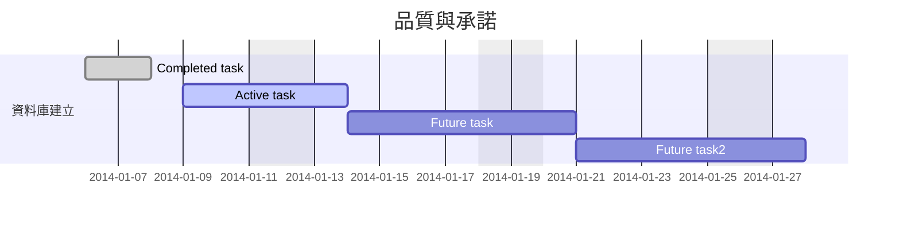

# 智慧營運

## Kanban

### Backlog
1. 製程履歷顯示超規
### TODO

1. SN Number to Panel ID -> 由 iEDA
2. Panel ID to Glass ID(需要各 Fab 規則) -> 由 iEDA
3. 材料驗証實驗材料組態修改 -> 需要 RAS 開單人資料
4. 材料組態 + RA + 製程參數輸出
5. 和設計與選材系統串接
6. 新增 RA Spec 資料庫 ->設計與選材小組一
7. CMCDN Border 轉為數值型
### On Going
### Complete

